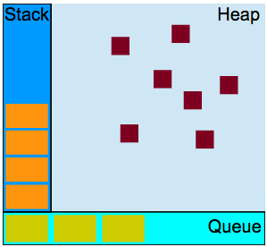
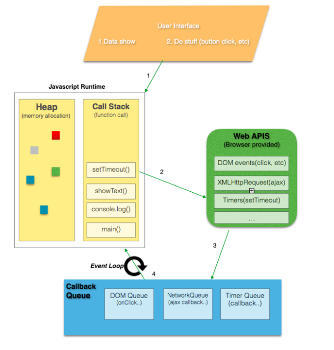

# Javascript - Call Stack

> 자바스크립트 함수 실행 - call stack, event loop, tasks

<br>

## In summary

1. 싱글 스레드. 한번에 한가지의 일만 할 수 있다는 뜻.
2. 코드 실행이 동기적으로 진행됩니다.
3. 함수 호출은 임시 메모리를 차지하는 스택 프레임을 생성합니다.
4. LIFO - Last in, First Out 구조. (후입선출)

<br>

## Js is a single threaded

한번에 하나의 작업 또는 코드 조각을 처리할 수 있습니다.



<br>

## Call stack

> 여러 함수들을 호출하는 스크립트에서 해당 위치를 추적하는 인터프린터를 위한 메커니즘.

현재 어떤 함수가 동작하고 있는 지, 그 함수내에서 어떤 함수가 동작하는 지, 다음에 어떤 함수가 호출되어야하는지 등을 제어합니다.

-   스크립트가 함수를 호출하면 인터프린터는 이를 호출 스택에 추가한 다음 함수를 수행하기 시작합니다.
-   해당 함수에 의해 호출되는 모든 함수는 호출 스택에 추가되고 호출이 도달하는 위치에서 실행합니다.
-   메인 함수가 끝나면 인터프린터는 스택을 제거하고 메인 코드 목록에서 중단된 지점부터 다시 시작합니다.
-   스택이 할당된 공간보다 많은 공간을 차지하면 `stack overflow` 에러를 발생시킵니다.

```javascript
// Stack trace error

function A() {
	throw new Error('Oops!');
}
function B() {
	A();
}
function C() {
	B();
}
C();

/* console
algo.js:2 Uncaught Error: Oops!
    at A (algo.js:2)
    at B (algo.js:5)
    at C (algo.js:8)
    at algo.js:10
*/
```


<br>

## Heap

변수, 객체는 모두 이곳에 할당됩니다.

<br>

## Queue

처리할 메시지 목록과 실행할 관련 콜백 함수 목록을 저장.

<br>

## Event loop


